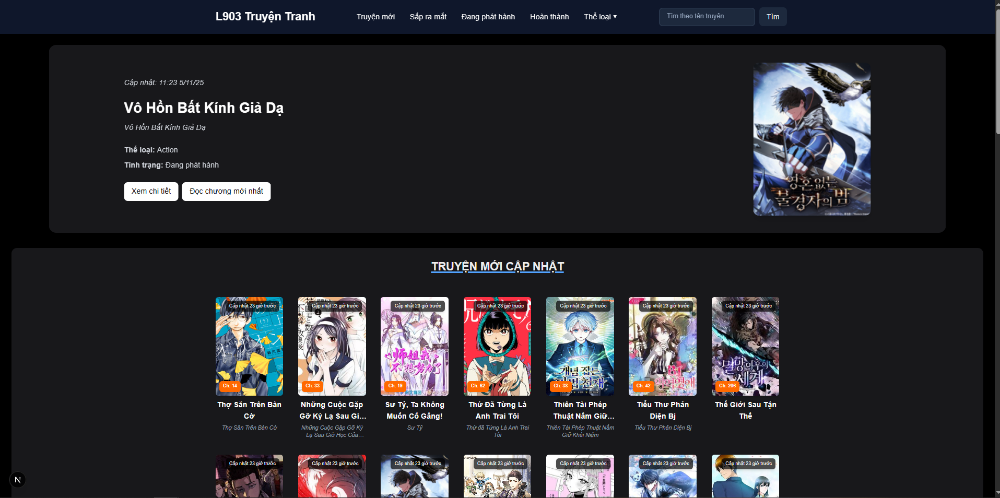

# L903 Truyện Tranh

Một dự án web đọc truyện đơn giản được xây dựng bằng **Next.js** dùng [otruyenApi](https://docs.otruyenapi.com/#/)

## Tính năng

- Đọc truyện, tìm truyện
- Markbook (sắp có) và lịch sử đọc (sắp có)

## Công nghệ sử dụng

- [Next.js](https://nextjs.org/)
- [React](https://react.dev/)
- [Tailwind CSS](https://tailwindcss.com/)

## Minh họa



## Run

```bash
# Cài đặt dependencies
npm install

# Chạy ở chế độ phát triển
npm run dev

# Build production
npm run build
```
